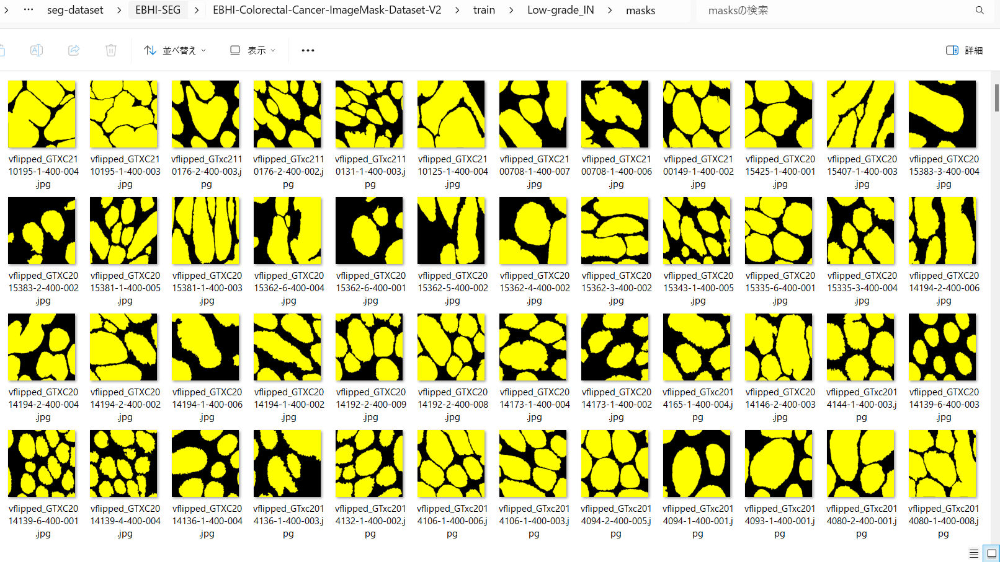
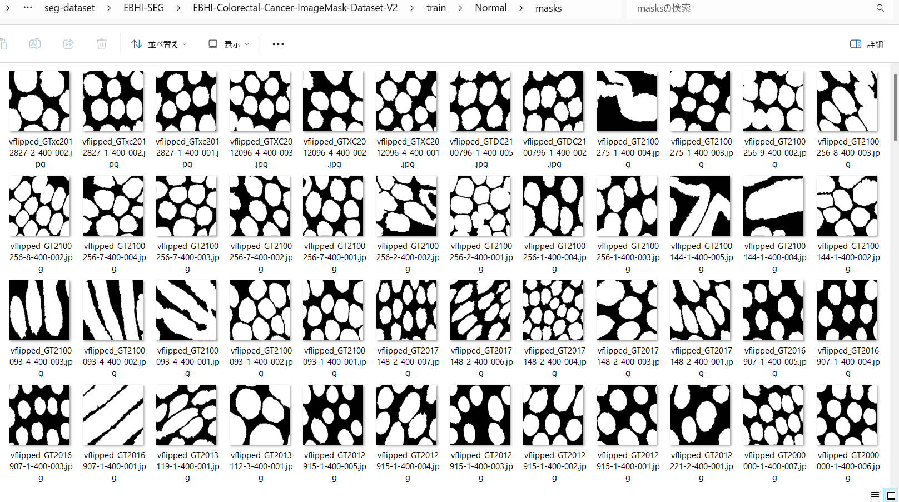

<h2> ImageMask-Dataset-EBHI-Colorectal-Cancer (2024/04/06)</h2>

This is a Pre-Augmented EBHI-SEG ImageMask Dataset. 
The dataset used here has been taken from the following figshare.com:EBHI-SEG 
<pre>
https://figshare.com/articles/dataset/EBHI-SEG/21540159/1
</pre>

You can download the <b>EBHI-Colorectal-Cancer-ImageMask-Dataset</b> from the google drive
<a href="https://drive.google.com/file/d/1GM9leTP1XFW5qZuog14vdcqqpk_BUCfX/view?usp=sharing">
EBHI-Colorectal-Cancer-ImageMask-Dataset-V2.zip
</a>
 

<h3>1. Dataset Citation</h3>
About dataset 
<pre>
This publicly available dataset contained 5,170 images of six types of tumor differentiation stages 
and the corresponding ground truth images. 
The dataset can provide researchers with new segmentation algorithms for medical diagnosis of colorectal 
cancer, which can be used in the clinical setting to help doctors and patientsThe dataset in the present 
study contained 5,710 histopathology images, including 2,855 histopathology section images and 2,855 
ground truth images.
</pre>

Please see also: 
<b>EBHI-Seg: A novel enteroscope biopsy histopathological hematoxylin and eosin image dataset for image segmentation tasks</b>
<pre>
https://www.frontiersin.org/articles/10.3389/fmed.2023.1114673/full
</pre>
 

<h3>2. ImageMaskDataset Generation</h3>

Please download the master dataset <b>EBHI-SEG</b> from the following link on figshare.com.  
<pre>
https://figshare.com/articles/dataset/EBHI-SEG/21540159/1
</pre>

Please run the following command for Python script <a href="./EBHIColorectalImageMaskDatasetGenerator.py">EBHIColorectalImageMaskDatasetGenerator.py</a>.
 
<pre>
> python EBHIColorectalImageMaskDatasetGenerator.py
</pre>
, by which the following Augmented-ImageMask Dataset, <b>EBHI-Colorectal-Cancer-ImageMask-Dataset-V2</b>, will be created
 from the master datatset . 
<pre>
./EBHI-Colorectal-Cancer-ImageMask-Dataset-V2
├─test
│  ├─Adenocarcinoma
│  │  ├─images
│  │  └─masks
│  ├─High-grade_IN
│  │  ├─images
│  │  └─masks
│  ├─Low-grade_IN
│  │  ├─images
│  │  └─masks
│  ├─Normal
│  │  ├─images
│  │  └─masks
│  ├─Polyp
│  │  ├─images
│  │  └─masks
│  └─Serrated_adenoma
│      ├─images
│      └─masks
├─train
│  ├─Adenocarcinoma
│  │  ├─images
│  │  └─masks
│  ├─High-grade_IN
│  │  ├─images
│  │  └─masks
│  ├─Low-grade_IN
│  │  ├─images
│  │  └─masks
│  ├─Normal
│  │  ├─images
│  │  └─masks
│  ├─Polyp
│  │  ├─images
│  │  └─masks
│  └─Serrated_adenoma
│      ├─images
│      └─masks
└─valid
    ├─Adenocarcinoma
    │  ├─images
    │  └─masks
    ├─High-grade_IN
    │  ├─images
    │  └─masks
    ├─Low-grade_IN
    │  ├─images
    │  └─masks
    ├─Normal
    │  ├─images
    │  └─masks
    ├─Polyp
    │  ├─images
    │  └─masks
    └─Serrated_adenoma
        ├─images
        └─masks
</pre>
To create our augmented dataset,we resized 
all images and masks of the original dataset to be 512x512 pixel-size from 224x224, and 
vertically, horizontally flipped, and futhermore rotated by angle in [90, 180, 270].
For simplicity, no image deformation or distortion operation applied. 
In the augmented dataset, we also colorized the mask images per category with different colors 
instead of the original black and white color. 
 

 
Generated Train Dataset Samples 

Adenocarcinoma 
 
 

High-grade_IN 
 
 

Low-grade_IN 
 
 

  
Normal 
 
 

Polyp 
 
 

Serrated_adnoma 
 
 

